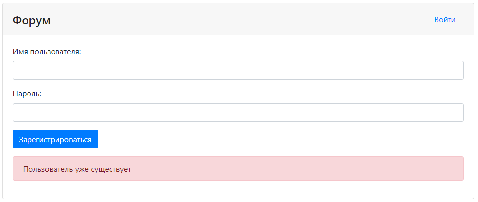

# Проект - Forum
[](https://travis-ci.com/saimon494/job4j_forum)
[](https://codecov.io/gh/saimon494/job4j_forum)

## О проекте
* Данное Spring Boot приложение представляет собой форум:
  <br>
* При добавлении темы необходимо указать название и описание:
  <br>
* Есть возможность редактировать тему:
  <br>
* Можно добавить сообщение в тему:
  <br>
* Неавторизованные пользователи с приложением работать не могут.
* Авторизация построена на Spring Security. Все зарегистрированные пользователи хранятся в БД,
пароли - в закодированном виде. Форма авторизации:
  <br>
* Есть регистрация новых пользователей, которая основана на контроллере RegControl. Форма регистрации:
  <br>
* По умолчанию в БД хранится пользователь с ролью администратора. Его логин - *root*, пароль - *secret*.
* Все формы приложения провалидированы с помощью JS и JQuery:
  <br>
  <br>
* Приложение построено на трёх слоях: по работе с БД, контроллеры, сервисы.
* В качестве БД используется PostgreSQL.
* Работа с БД осуществляется через Spring Data JPA.
* Слой контроллеров использует Spring MVC.
* Слой сервисов содержит логику приложения.
* Проект построен по шаблону MVC. Все виды открываются через GET-методы контроллеров,
  что позволяет передавать на виды необходимые данные.
* В качестве видов используются JSP-страницы, реализованные с помощью HTML и Bootstrap.
* Для реализации логики отображения на видах используется JSTL.
* В качестве системы версионирования структуры БД используется Liquibase.
* На все контроллеры написаны тесты с помощью Spring Test.
* Приложение доступно на облачной платформе [Heroku](https://secure-basin-81900.herokuapp.com/).
* Реализована интеграция Travis CI с Heroku.

## Сборка

Для сборки проекта необходимо:
1. Установить JDK 14.
2. Установить Maven.
3. Установить сервер БД PostgreSQL, задать логин - *postgres*, пароль - *password*.
4. Скачать исходный код проекта.
5. Перейти в корень проекта, где лежит файл `pom.xml`.
6. Собрать проект командой `mvn -DskipTests=true package`.
   При успешной сборке должна появиться папка target c `forum-2.war`.
7. Создать в pg_Admin БД *forum*.
8. Открыть Query Tool для созданной БД и запустить SQL-скрипты `schema.sql`, `insert.sql`
    из папки `db`.

## Использование

Запускаем приложение:
```
java -jar forum-2.war
```

Перейдем на главную [страницу](http://localhost:8080/forum/), зарегистрируемся и авторизуемся:


Добавим тему:


Проверим результат и отредактируем описание, нажав на соответствующую кнопку:


Зайдем в Тему "Правила форума" и оставим там сообщение:


Сообщение сохранилось с указанием автора и даты:


## Контакты
[](https://t.me/Saimon494)